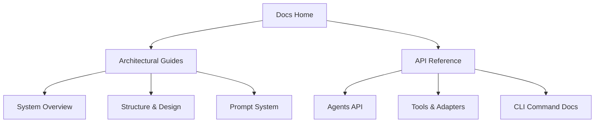

# 🤖 DV-Agentic-System

> **Core AI Agentic System for UVM (Universal Verification Methodology) & pyuvm Hardware Verification**

Welcome to the official developer documentation for `dv-agentic-system` — a state-of-the-art, multi-agent artificial intelligence framework engineered to automate and optimize the design verification pipeline.

---

## 🚀 Key Capabilities

Our agentic ecosystem is designed to solve complex hardware verification challenges through collaborative specialized sub-agents:

* **🧠 Multi-Agent Collaboration**: Managed orchestrator coordinates spec analysts, code generators, sim controllers, and log analyzers.
* **⚡ Intelligent Code Generation**: Seamlessly generates target stimulus, checkers, and test sequences with UVM/pyuvm best practices.
* **📈 Closed-Loop Debugging**: Automatically executes simulator runs, parses logs, isolates root causes, and refines code until convergence is achieved.
* **🔍 Semantic Specification Analysis**: Parses design specifications to extract test intent and coverage goals.

---

## 🏛 Architecture & Design Tenets

The system is constructed with strict engineering rigor to ensure reliability, safety, and performance:

1. **Model-Tool-Instruction Separation**: Clean abstraction layer decoupling AI logic, execution environments, and system instructions.
2. **Dynamic Escalation Guardrails**: Prevents token budget burn by escalating immediately to human review when circular loops or shifting failure spaces are detected.

---

## 🗺 Documentation Guide

Discover our documentation through three main tracks:



### 📘 Architecture
* [**System Overview**](agentic-system.md): Read about the high-level workflows and multi-agent topology.
* [**Structure & Design**](agentic-system-structure.md): Deep dive into classes, states, and the orchestrator decision lifecycle.
* [**Prompt System**](prompt-system.md): Learn how templates and system instructions are loaded dynamically based on task context.
* [**LLM Wiki**](llm-wiki.md): Architecture and usage guide for the Git-versioned Markdown knowledge base that compounds verification insights across sessions.

### ⚙️ API Reference
* [**Agents API**](api/agents.md): Reference details for orchestrator and sub-agents.
* [**Tools & Adapters**](api/tools.md): Documentation on simulation adapters, LLM interfaces, and environment control.
* [**CLI Reference**](api/cli.md): Commands to run tests, compile docs, and perform manual triage.

---

## 🏁 Quick Start

To install dependencies and build documentation locally:

```bash
# Clone the repository
git clone https://github.com/anlit75/dv-agentic-system.git
cd dv-agentic-system

# Install dependencies using uv
uv sync --all-groups

# Build and serve documentation locally with live-reload
uv run mkdocs serve
```
